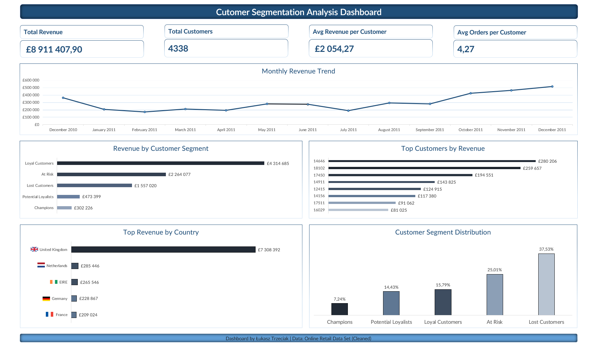

# 📊 Customer Segmentation Analysis (RFM)

## 🧩 Business Problem

Understanding customer behavior is one of the most important areas of e-commerce analytics.  
Not all customers contribute equally to revenue, and different groups require different retention strategies.

The goal of this project was to analyze customer purchasing behavior using **RFM segmentation** to identify the most valuable customers and detect customers at risk of churn.

The analysis focuses on:

- customer purchase recency
- order frequency
- customer monetary value
- customer segment distribution
- revenue contribution by segment

---

## 📁 Dataset

This project uses the **Online Retail Dataset** from Kaggle.

Dataset characteristics:

- **Initial records:** 541,909
- **Records after cleaning:** 532,621
- **Date range:** 2010-12-01 to 2011-12-09

Main columns used:

- `InvoiceNo`
- `InvoiceDate`
- `CustomerID`
- `Quantity`
- `UnitPrice`
- `Country`

---

## 🛠 Data Cleaning

The following cleaning steps were applied before the analysis:

- removed cancelled invoices (`InvoiceNo` starting with `"C"`)
- removed records with non-positive quantity
- removed records with zero unit price
- kept only valid customer transactions
- standardized date format before import

---

## 🛠 Tools Used

- **MySQL** – data querying and analysis  
- **DBeaver** – database management  
- **Microsoft Excel** – dashboard and visualization  
- **GitHub** – project documentation  

---

## 📈 Key KPIs

The following key business metrics were calculated:

- **Total Revenue:** 8,911,407.90
- **Total Customers:** 4,338
- **Average Revenue per Customer:** 2,054.27
- **Average Orders per Customer:** 4.27

---

## 🔍 RFM Analysis

RFM segmentation is based on three customer dimensions:

- **Recency** – how recently a customer made a purchase
- **Frequency** – how often a customer makes purchases
- **Monetary** – how much a customer spends

Based on these metrics, customers were grouped into the following segments:

- Champions
- Loyal Customers
- Potential Loyalists
- At Risk
- Lost Customers

---

## 📊 Key Findings

Customer segment distribution:

- **Lost Customers:** 1,628 (**37.53%**)
- **At Risk:** 1,085 (**25.01%**)
- **Loyal Customers:** 685 (**15.79%**)
- **Potential Loyalists:** 626 (**14.43%**)
- **Champions:** 314 (**7.24%**)

### Insights

- More than **62% of customers** belong to the **Lost Customers** or **At Risk** segments.
- Only **7.24%** of customers are classified as **Champions**, indicating that the most valuable customer base is relatively small.
- The business has a strong opportunity to improve retention by targeting **Potential Loyalists** and **At Risk** customers.
- RFM analysis highlights a clear imbalance between high-value active customers and inactive or declining customer groups.

---

## 📊 Dashboard

The Excel dashboard includes:

- KPI summary
- Monthly Revenue Trend
- Revenue by Country
- Customer Segment Distribution
- Revenue by Segment
- Top Customers by Revenue

### Dashboard Preview

---

## 📂 Project Structure

customer-segmentation-analysis/

│  
├── sql/  
│   └── rfm_analysis.sql  
│  
├── excel/  
│   └── dashboard.xlsx  
│  
├── screenshots/  
│   └── dashboard.png  
│  
└── README.md  

---

## 🎯 Conclusion

This project shows how customer transaction data can be transformed into actionable business insights using RFM segmentation.

The analysis reveals that a large share of customers are inactive or at risk, while only a small group represents the most valuable customer base.  
These findings can support retention strategies, customer targeting, and revenue optimization.
